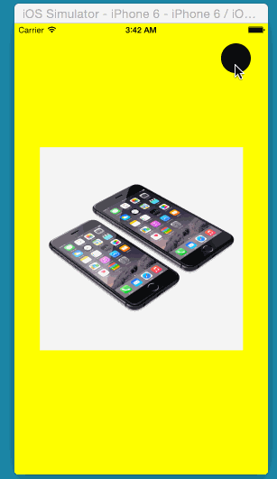

# CircleTransition

Using CAShapeLayer to mask views, CABasicAnimation & UIViewControllerAnimatedTransition.

http://www.raywenderlich.com/86521/how-to-make-a-view-controller-transition-animation-like-in-the-ping-app#custom_animation

